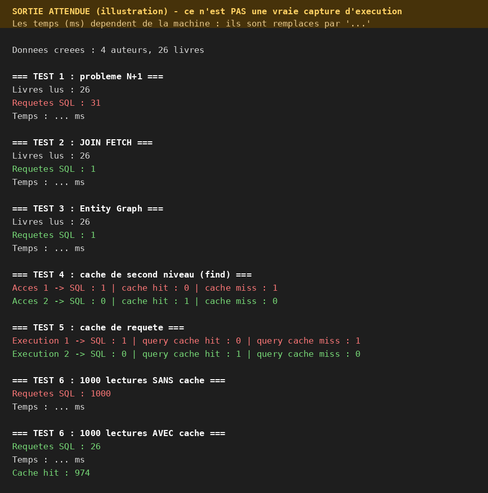

# TP 7 : Cache de second niveau, N+1, JOIN FETCH et Entity Graph

## Objectif
Mesurer l'effet du cache de second niveau (Ehcache) et supprimer le problème N+1 avec `JOIN FETCH` et un entity graph (JPA / Hibernate, H2).

## Lancer
Ouvrir le projet (NetBeans ou IntelliJ), attendre Maven, puis exécuter `App`.

## Principe
- **N+1** : 1 requête pour les auteurs, puis 1 par auteur et 1 par livre (31 requêtes).
- **JOIN FETCH / Entity Graph** : tout est chargé en 1 seule requête.
- **Cache de second niveau** : le 2e accès à une entité ne touche plus la base (hit).
- **Cache de requête** : la même requête exécutée deux fois ne génère du SQL qu'une fois.

## Résultat attendu

